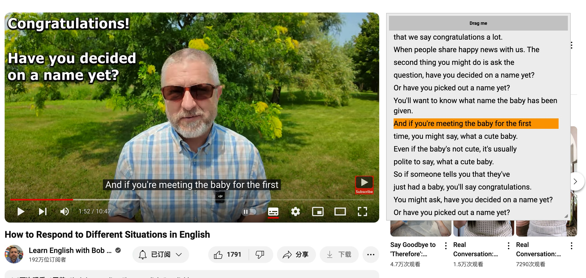

# Description
Simple youtube subtitles panel, make you easy to read subtitles and shadow reading

# Example

# Install

* Before you install this script , you must install tampermonkey or greasemonkey in chrome app store or firefox add-ons store
<a href="https://chromewebstore.google.com/detail/tampermonkey/dhdgffkkebhmkfjojejmpbldmpobfkfo">Chrome App Store</a>
 
* Click the link below to install this script
<a href="https://raw.githubusercontent.com/fqdeng/youtube-subtitles-panel/master/main.user.js">Install</a>